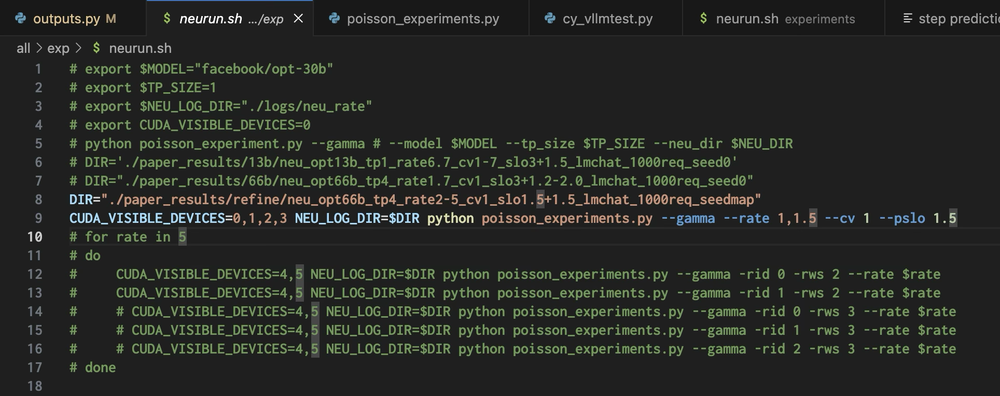
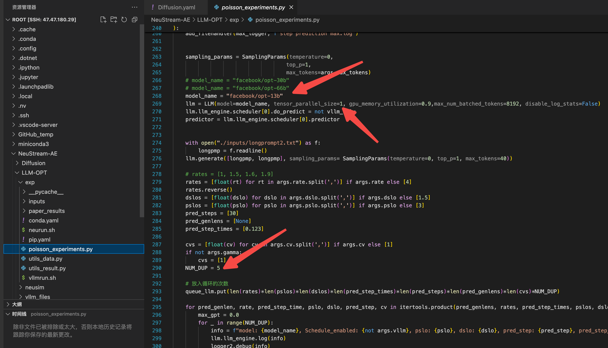
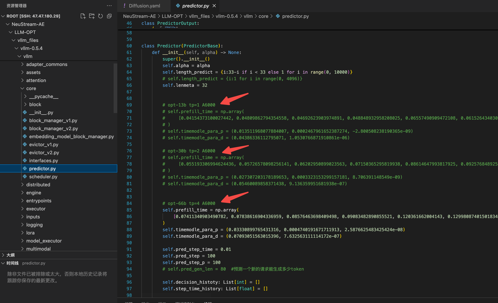

# NeuStream-AE
Artifact Evaluation for NeuStream: Bridging Deep Learning Serving and Stream Processing, EuroSys25.
_____________

The experiments consist of three main parts: Diffusion, LLM, and Multi-Agent. For each part, we simulate a sering workload, send bulk requests to deployed modules through cross-process queues, and measure the system performance by goodput(the number of served requests that meet their SLO requirements per unit of time.).

1. #### Environment setup
2. 
   Below is how to set up the environments:

   1. Diffusion environment setup: 

      1. `conda env create -f NeuStream-AE/Diffusion/Diffusion.yaml`

      2. Comment out one line in installed diffusers library

         1. ```python
            # file_path: miniconda3/envs/Diffusion/lib/python3.12/site-packages/diffusers/utils/dynamic_modules_utils.py
            
            # from huggingface_hub import cached_download, hf_hub_download, model_info
            from huggingface_hub import hf_hub_download, model_info
            ```

   2. LLM environment setup:

      1. We modified vLLM to support NeuSream's temporal scheduling.

         ```
         conda create -n LLM-OPT python=3.9 -y
         cd /root/NeuStream-AE/LLM-OPT/vllm_files/vllm-0.5.4
         pip install -e .
         ```

   3. Multi-Agent environment setup:

      1. See `NeuStream-AE/MatplotAgent/README.md` for details

3. #### Experiments

   1. **Diffusion** experienments

      1. The scripts to launch experiments are below

         1. We have profiled data inside program to direct batching mechanism, so the results can be reproduced when launched on corresponding GPUs.

         ```shell
         # DiT_S_2 256x256 image generation on RTX 4090
             NeuStream-AE/Diffusion/DiT/RTX4090_DiT_S_2_img256/run_clockwork.sh
             NeuStream-AE/Diffusion/DiT/RTX4090_DiT_S_2_img256/run_neustream.sh
         # DiT_XL_2 256x256 image generation on RTX 4090
         		NeuStream-AE/Diffusion/DiT/RTX4090_DiT_XL_2_img256/run_clockwork.sh
         		NeuStream-AE/Diffusion/DiT/RTX4090_DiT_XL_2_img256/run_neustream.sh
         # Palette 256x256 image restoration on RTX 4090
         		NeuStream-AE/Diffusion/Palette/run_clockwork.sh
         		NeuStream-AE/Diffusion/Palette/run_neustream.sh
         # SD v1.5 256x256 image generation on RTX 4090
         		NeuStream-AE/Diffusion/StableDiffusion/RTX4090_SD_FP16_img256/run_clockwork.sh
         		NeuStream-AE/Diffusion/StableDiffusion/RTX4090_SD_FP16_img256/run_neustream.sh
         # SD v1.5 512x512 image generation on RTX 4090
         		NeuStream-AE/Diffusion/StableDiffusion/RTX4090_SD_FP16_img512/run_clockwork.sh
         		NeuStream-AE/Diffusion/StableDiffusion/RTX4090_SD_FP16_img512/run_neustream.sh
         # SD v1.5 512x512 image generation on H100
         		NeuStream-AE/Diffusion/StableDiffusion/H100_SD_FP16_img512/run_clockwork.sh
         		NeuStream-AE/Diffusion/StableDiffusion/H100_SD_FP16_img512/run_neustream.sh
         		
         ```

         2. Each experiment script will log the serving details in corresponding log file. The goodput is collected from serving log of different rate,cv, and slo. For example, compare logs

             `NeuStream-AE/Diffusion/DiT/RTX4090_DiT_S_2_img256/neustream_rate_log_request500/2024-04-28 17:41:55_Gamma_rate=4_cv=2_slo_factor=3.0_request=500_step_delta=0.95_device=RTX4090_image_size=256_2024-04-28 17:41:55`

             and

             `NeuStream-AE/Diffusion/DiT/RTX4090_DiT_S_2_img256/clockwork_rate_log_request500/2024-04-28 17:47:55_Gamma_rate=4_cv=2_slo_factor=3.0_request=500_device=RTX4090_image_size=256.log`, 

            we will find that when serving a workload with rate=4qps, cv=2, and slo=3, NeuStream achieves 463 goodput while clockwork's algorithm achieves 86 goodput. These data points from logs make up the Figure 11 and Figure 12 in the paper.

         3. The Figure 13 shows the batch size of DiT module when serving workload by NeuStream and Clockwork, it can be plotted by extract th DiT module size in log files like `NeuStream-AE/Diffusion/DiT/RTX4090_DiT_S_2_img256/neustream_rate_log_request500/2024-04-28 17:41:55_Gamma_rate=4_cv=2_slo_factor=3.0_request=500_step_delta=0.95_device=RTX4090_image_size=256_DiTModule.log` and `NeuStream-AE/Diffusion/DiT/RTX4090_DiT_S_2_img256/clockwork_rate_log_request500/2024-04-28 17:47:55_Gamma_rate=4_cv=2_slo_factor=3.0_request=500_device=RTX4090_image_size=256.log` . 

            ```
            # For example
            
            # Below log that shows Clockwork batch 3 requests at this round.
            0号worker ---- good : 53 --- finish: 55 --- id: 290 309 310  
            
            # Below log shows NeuStream batch 10 requests at this round.
            {"batch_size": 10, "time": 1714297483.5302887, "high_priority_count": 4, "low_priority_count": 6, "queue_size_before_schedule": 10, "batch_size_after_schedule": 0, "running_requests_id_list": [490, 491, 492, 498, 499, 497, 496, 495, 493, 494], "rest_time": [3.1086456775665283, 2.217283248901367, 3.7875068187713623, 2.854764223098755, 2.882814884185791, 3.5825355052948, 3.6029703617095947, 3.283489465713501, 2.5172903537750244, 3.5290353298187256]}
            
            ```

   2. **LLM-OPT** experiments

      1. We use the OPT model family to test the workload. For convenience, we didn’t include origin model parameters in the Artifacts. Under our evaluation in Figure 14 & 15, we choose the co-locate settings, so the prefill and decode instance are located in same process, and the implementation transforms to the execution order of prefilling and decoding, as shown in paper’s Figure 10.

      2. - To reproduce the data, it needs the NVIDIA A6000 and H100 accelerators.

         - In the OPT-LLM folder, you can see three subfolders, **exp** is for experiments, **neusim** is used for simulating the latency of prefill & decode execution when under different batch sizes or prefix lengths, and **vllm_files** is the modified vLLM to support NeuStream in co-locating setting. 

         - **Experiments**:

         - - To launch NeuStream, run **NeuStream-AE/LLM-OPT/exp/neurun.sh**
           - To launch origin vLLM, run **NeuStream-AE/LLM-OPT/exp/vllmrun.sh**
           - You can change the rate, cv, or slo through modifying the scripts, like below picture 
             - 
             - The above command support multiple parameters in rate, cv or slo, but we recommend only passing one group multiple parameters.
             - Model size and corresponding tensor parallelism need mannually specification. Our search shows that the best tensor parallelism for OPT 13B, 30B, and 66B is 1, 2, and 4 respectively(On NVIDIA A6000 and H100). NUM DEDUP is the number of repeated experiment groups in a setting, which can be set to 1 during the test. 
               - 
             - The final output log contains a step prediction max.log, which will output the highest goodput value in each of these experiments separately. 
               - the file path is :
             - Besides, when test different models, user has to manually specify the prediction/simulation data for the certain model.
               - 
   
   3. **Multi-Agents experienments**
      1. See details in `Multi-Agent/README.md`.
________

We omitted some necessary model parameter files, user can obtain them in [link](https://github.com/Fjallraven-hc/NeuStream-AE).

Because of the GitHub file size limitation, user has to manually run the script `merge_large_file_fragment.sh` to get the origin model parameters.  
For convenience, we didn't upload unnecessary model parameters, so part of the models are serving with randomly initialized parameters, but this has no effect on the serving performance.
